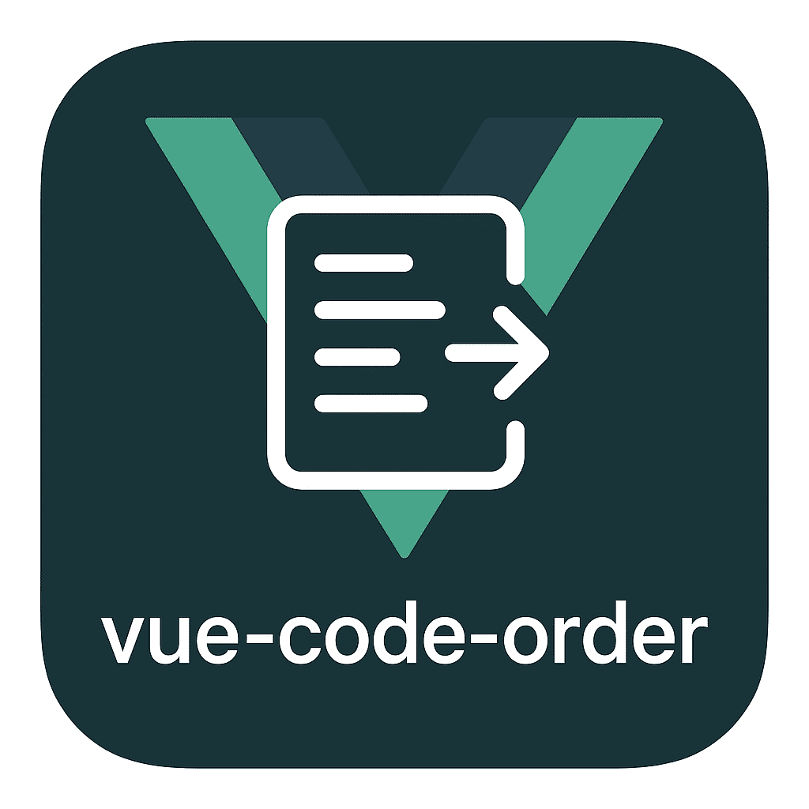

# Vue Code Order Hover

Для связи рекомендую использовать телеграм: @ByEfimovv



VS Code extension that shows function categories when hovering over functions in Vue files with `<script setup>`. Perfect for maintaining clean and organized Vue.js code structure!

<br clear="left"/>

---

## ✨ Features

- 🎯 **Instant categorization** - Hover over any function to see its category
- 📊 **Order visualization** - Shows the recommended position of each group
- 🔧 **ESLint integration** - Uses the same categorization logic as `eslint-plugin-vue-code-order`
- ⚙️ **Configurable** - Toggle descriptions and functionality through VS Code settings
- 🚀 **Smart detection** - Works with destructuring, await expressions, and complex patterns
- 🎨 **Beautiful tooltips** - Rich hover information with emojis and descriptions

## 🎬 Demo

When you hover over functions in your Vue `<script setup>` blocks, you'll see helpful tooltips:

### Hovering over `useRoute()`:

```
Vue Code Order Category: framework-init
🔧 Framework initialization - Vue, Nuxt, and core composables
Order position: 3
```

### Hovering over `ref()`:

```
Vue Code Order Category: variables
📊 Variables - Reactive state and references
Order position: 9
```

## 📋 Supported Categories

| Category                    | Functions                                    | Description                | Order |
| --------------------------- | -------------------------------------------- | -------------------------- | ----- |
| 🔧 Framework initialization | `useRoute`, `useRouter`, `useNuxtApp`        | Vue, Nuxt core composables | 3     |
| 🏪 Stores                   | `useStore`, `usePinia`, `*Store`             | Pinia and Vuex stores      | 4     |
| 🎨 UI Libraries             | `useToast`, `useModal`, `useQuasar`          | UI component frameworks    | 5     |
| 📚 Libraries                | `useClipboard`, `useAxios`, `useLodash`      | External libraries         | 6     |
| 🛠️ Utils                    | `formatDate`, `parseData`, `use*Util`        | Utility functions          | 7     |
| ✅ Validation               | `useVuelidate`, `schema`, `validate*`        | Form validation            | 8     |
| 📊 Variables                | `ref`, `reactive`, `computed`                | Reactive state             | 9     |
| 🌐 Server Requests          | `useAsyncData`, `useFetch`, `useQuery`       | API calls                  | 10    |
| 🔄 Computed & Hooks         | `computed`, `use*Hook`, `use*Custom`         | Custom composables         | 11    |
| ⚡ App Functions            | `handle*`, `on*Click`, `submit*`             | Event handlers             | 12    |
| 🔍 Modals                   | `openModal`, `showDialog`, `*Modal`          | Modal operations           | 13    |
| 👀 Watchers & Listeners     | `watch`, `addEventListener`, `use*Observer`  | Watchers & listeners       | 14    |
| 🔄 App Lifecycle            | `onMounted`, `definePageMeta`, `onUnmounted` | Vue lifecycle              | 15    |

## 🚀 Usage

1. **Install the extension** from VS Code Marketplace
2. **Open a Vue file** with `<script setup>` block
3. **Hover over any function** (useRoute, computed, ref, etc.)
4. **See the category tooltip** with helpful information!

## ⚙️ Settings

Configure the extension behavior in VS Code settings:

- `vueCodeOrderHover.enabled` - Enable/disable hover tooltips (default: `true`)
- `vueCodeOrderHover.showDescription` - Show category descriptions (default: `true`)

## 📋 Examples

Here's what you'll see when hovering over different functions:

```vue
<script setup lang="ts">
// Hover over these functions to see categories:
const route = useRoute(); // 🔧 Framework initialization - Order: 3
const userStore = useUserStore(); // 🏪 Stores - Order: 4
const message = ref("Hello"); // 📊 Variables - Order: 9
const fullName = computed(() => `${firstName} ${lastName}`); // 🔄 Computed & Hooks - Order: 11
const { data } = await useAsyncData("users", fetchUsers); // 🌐 Server Requests - Order: 10

const handleSubmit = () => {
  // ⚡ App Functions - Order: 12
  console.log("Form submitted");
};

watch(message, (newValue) => {
  // 👀 Watchers & Listeners - Order: 14
  console.log("Message changed:", newValue);
});

onMounted(() => {
  // 🔄 App Lifecycle - Order: 15
  console.log("Component mounted");
});
</script>
```

## 🔧 Requirements

- **VS Code** 1.74.0 or newer
- **Vue files** with `<script setup>` blocks
- Works with **Vue 3** and **Composition API**

## 🤝 Related Projects

- **[eslint-plugin-vue-code-order](https://github.com/ByEfimov/eslint-plugin-vue-code-order)** - ESLint plugin for automatic code order checking
- **Perfect companion** - Use both tools together for the best Vue.js development experience

## 📝 License

MIT

## 🐛 Issues & Feedback

Found a bug or have a suggestion? Please [create an issue](https://github.com/ByEfimov/eslint-plugin-vue-code-order/issues) on GitHub.

---

**Enjoy cleaner Vue.js code organization! 🎉**
